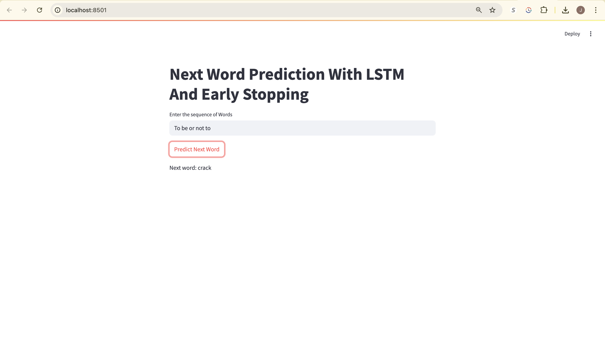

# Next Word Prediction App with Streamlit + LSTM

*Predict Shakespeare’s next word like a language wizard*

## Overview

This project demonstrates a **Next Word Prediction** system using an **LSTM (Long Short-Term Memory)** neural network trained on Shakespeare’s *Hamlet*. The model learns to predict the next word in a sentence using past context and is deployed with a sleek **Streamlit** interface for real-time word suggestions.

## Features

*  Trained on **Hamlet** using NLTK's Gutenberg corpus
*  Built with **LSTM** and **Early Stopping** for optimized learning
*  **Streamlit web app** for interactive next-word prediction
*  Includes experimentation notebook and model comparisons

##  Try it Yourself

Launch the app locally with:

```bash
streamlit run app.py
```


##  Project Structure

```
├── app.py                       # Streamlit App
├── experiments.ipynb            # Model training & exploration
├── next_word_lstm.h5            # Final trained LSTM model
├── next_word_lstm_model_with_early_stopping.h5            # (Optional) Alternate model
├── tokenizer.pickle             # Fitted tokenizer object
├── requirement.txt             
└── README.md                   
```

##  Requirements

Install dependencies with:

```bash
pip install -r requirement.txt
```

##  Demo Preview

**Input:** `To be or not to`
**Predicted Next Word:** `be`

##  Credits

* Text data: [Project Gutenberg - NLTK](https://www.nltk.org/nltk_data/)
* NLP modeling: TensorFlow / Keras
* UI: Streamlit

---
